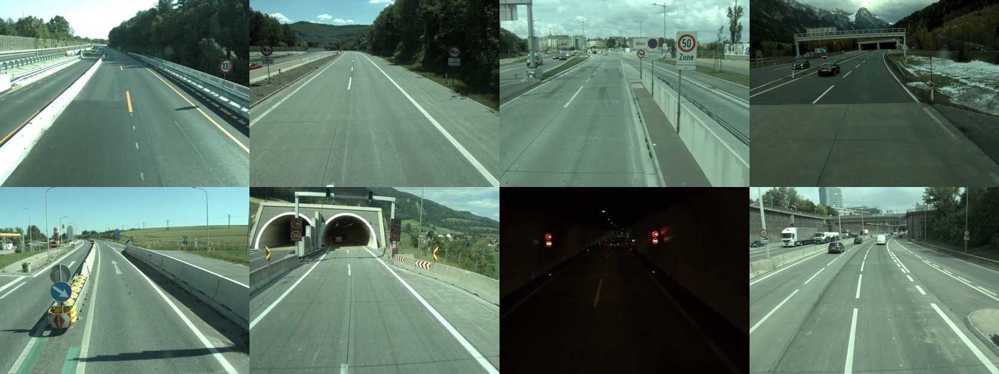

# ATSD - Austrian Highway Traffic Sign Data Set

<div align="center">
  
</div>

This repository accompanies the **[Austrian Highway Traffic Sign Data Set (ATSD)](https://contentportal.asfinag.at/ATSD)**,
a large data set of annotated traffic scene and -sign images that can be used for training and benchmarking traffic sign
recognition models. The repository contains example Jupyter notebooks with Python code for loading images and meta data,
augmenting the data set, and applying trained traffic sign detection- and classification models.

## Installation

Clone the repository and create a new environment from `requirements.txt`:
```
# pip
pip install -r requirements.txt

# conda
conda create --name <env_name> --file requirements.txt
```

## Contents

The main contents of this repository are Jupyter notebooks for illustrating how to work effectively with the data set,
as well as trained baseline detection- and classification models.
The data set itself can be downloaded **[here](https://contentportal.asfinag.at/ATSD)**.

* **[Classification_Preparation.ipynb](https://github.com/risc-mi/atsd/blob/main/Classification_Preparation.ipynb)**
  shows how traffic sign images and related
  meta-data from ATSD-Signs can be loaded, analyzed and augmented with traffic-sign-specific augmentation methods.
  It forms the basis for subsequently training classification models, although the model training itself is not covered.
* **[Detection_Preparation.ipynb](https://github.com/risc-mi/atsd/blob/main/Detection_Preparation.ipynb)**
  shows how traffic scene images and related
  meta-data from ATSD-Scenes can be loaded and converted to a YOLO/Darknet compatible format.
  It forms the basis for subsequently training detection models, although the model training itself is not covered.
* **[Classification.ipynb](https://github.com/risc-mi/atsd/blob/main/Classification.ipynb)**
  shows how trained traffic sign classifiers can be applied to and
  evaluated on ATSD-Signs, including the necessary image pre-processing (resizing, scaling) steps.
* **[Detection.ipynb](https://github.com/risc-mi/atsd/blob/main/Detection.ipynb)**
  shows how trained traffic sign detectors can be applied to on the ATSD-Scenes.
* **[Evaluation.ipynb](https://github.com/risc-mi/atsd/blob/main/Evaluation.ipynb)** illustrates how results from
  detection+classification pipelines can be evaluated w.r.t. ground truth annotations, in terms of per-class average
  precision, mean average precision (mAP), etc.
* **[weights](https://github.com/risc-mi/atsd/blob/main/weights)** contains trained weights of baseline classifiers and detectors.
* **[results](https://github.com/risc-mi/atsd/blob/main/results)** contains pre-computed results of baseline
  detection+classification pipelines. See [Evaluation.ipynb](https://github.com/risc-mi/atsd/blob/main/Evaluation.ipynb)
  for information on how to make use of them.

## The Data Set

The Austrian Highway Traffic Sign Data Set (ATDS) contains high-resolution traffic scene and -sign images acquired on
Austrian highways in 2014 and annotated in 2020/2021. It consists of two main parts: **ATSD-Scenes** and
**ATSD-Signs**.

### ATSD-Scenes

ATSD-Scenes contains images of entire traffic scenes, where all traffic signs visible in a scene were manually
annotated with a tight bounding box and information about the class of the sign and whether it possesses certain
attributes (e.g., partly occluded, crossed-out, not normal to roadway, etc.). In total, there are **108** distinct
traffic sign classes partitioned into **10** main categories, like mandatory, prohibitory, danger, etc.

Every image has a resolution of **1596x1196** pixels, and there are **7454** images in total. The images are split into
the three disjoint sets *Train*, *Test* and *Internal* as follows:

| | Train | Test | Internal | Total |
|---|---|---|---|---|
| Images | 4,068 (54.57%) | 1,443 (19.36%) | 1,943 (26.07%) | 7,454 |
| Annotations | 15,042 (54.66%) | 5,485 (19.93%) | 6,994 (25.41%) | 27,521 |

*Train* and *Test* are part of the publicly available data, whereas *Internal* is kept private for being able to
benchmark detection models in an objective way.

### ATSD-Signs

ATSD-Signs contains images of traffic signs, extracted from the full-scene images of ATSD-Scenes. Of the 108 traffic
sign classes, the **60** most frequent appear in ATSD-Signs, as shown in the figure below.

<div align="center">
  
</div>

There are **20,683** images in total, split into the three disjoint sets *Train*, *Test* and *Internal*. The splits
correspond to the splits of ATSD-Scenes, i.e., a traffic sign image in *Train* was extracted from a scene in *Train*,
etc. In the following table, *Size* refers to the length of the diagonal, in pixels, and is displayed as *median*
(*min*-*max*).

| | Train | Test | Internal | Total |
|---|---|---|---|---|
| Images | 11,056 (53.45%) | 4,310 (20.84%) | 5,317 (25.71%) | 20,683 |
| Size | 91.2 (10.6-540.6) | 92.5 (11.6-507.7) | 97.5 (11.9-506.1) | 93.0 (10.6-540.6) |

*Train* and *Test* are part of the publicly available data, whereas *Internal* is kept private for being able to
benchmark classification models in an objective way.

## Leaderboard

Performance on the public test set is measured by training on the training set and evaluating on the test set.
Performance on the private internal set is measured by training on all public data (train+test) and evaluating on the
internal set.

If you want to add the results of your models, please open a GitHub issue or submit a pull request. For evaluating your
models on the internal set, please get in touch with us by opening a GitHub issue.

### Detection on ATSD-Scenes

| Name | Test | Test | Internal | Internal |
|---|---|---|---|---|
| | Categories | Classes | Categories | Classes |
| Baseline* | 85.39&#177;2.33 | 87.87&#177;2.29 | 86.40&#177;3.44 | 89.30&#177;2.22 |

*Baseline refers to the model architectures presented in
[Classification.ipynb](https://github.com/risc-mi/atsd/blob/main/Classification.ipynb), with geometric+LED data
augmentation as shown in
[Classification_Preparation.ipynb](https://github.com/risc-mi/atsd/blob/main/Classification_Preparation.ipynb). Results
are **mean average precision** (mAP), displayed as *mean*&#177;*SD* over three independent runs.

Results in columns Categories refer to the detection+classification of categories 01 to 08. Results in columns Classes
refer to the detection+classification of the 60 classes included in ATSD-Signs.

### Classification on ATSD-Signs

| Name | Test | Test | Internal | Internal |
|---|---|---|---|---|
| | Accuracy | Bal. Acc. | Accuracy | Bal. Acc. |
| Baseline* | 97.61&#177;0.24 | 95.75&#177;0.53 | 98.27&#177;0.25 | 97.65&#177;0.28 |

*Baseline refers to the model architecture presented in
[Classification.ipynb](https://github.com/risc-mi/atsd/blob/main/Classification.ipynb), with geometric+LED data
augmentation as shown in
[Classification_Preparation.ipynb](https://github.com/risc-mi/atsd/blob/main/Classification_Preparation.ipynb). Results
are displayed as *mean*&#177;*SD* over three independent runs.

## References

* Alexander Maletzky, Nikolaus Hofer, Stefan Thumfart, Karin Bruckmüller, and Johannes Kasper.
  "Traffic Sign Detection and Classification on the Austrian Highway Traffic Sign Data Set". *Data* 8(1), 2023.
  [DOI:10.3390/data8010016](https://doi.org/10.3390/data8010016)
  ```
  @article{ATSD_2023,
    title = {Traffic Sign Detection and Classification on the {A}ustrian {H}ighway {T}raffic {S}ign {D}ata {S}et},
    author = {Maletzky, Alexander and Hofer, Nikolaus and Thumfart, Stefan and Bruckm\"uller, Karin and Kasper, Johannes},
    journal = {Data},
    volume = {8},
    number = {1},
    year = {2023},
    issn = {2306-5729},
    url = {https://www.mdpi.com/2306-5729/8/1/16},
    doi = {10.3390/data8010016}
  }
  ```

## Contact

If you have any inquiries, please open a GitHub issue.